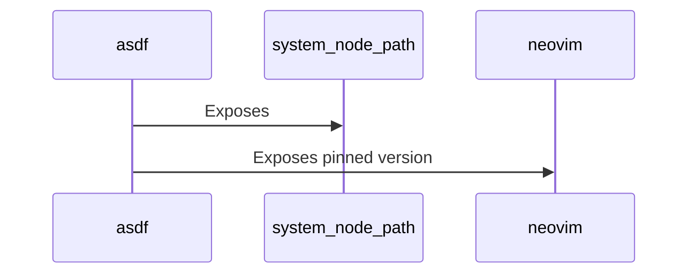

```lua
local env = vim.env
local node_path = "/home/crnvl96/.asdf/installs/nodejs/22.14.0"

env.PATH = node_path .. "/bin:" .. env.PATH
```

### Sequence Diagram explaining the workflow


```mermaid
sequenceDiagram
    participant asdf
    participant system_node_path
    participant neovim

    asdf ->> system_node_path: Exposes
    asdf ->> neovim: Exposes pinned version
```
